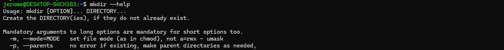
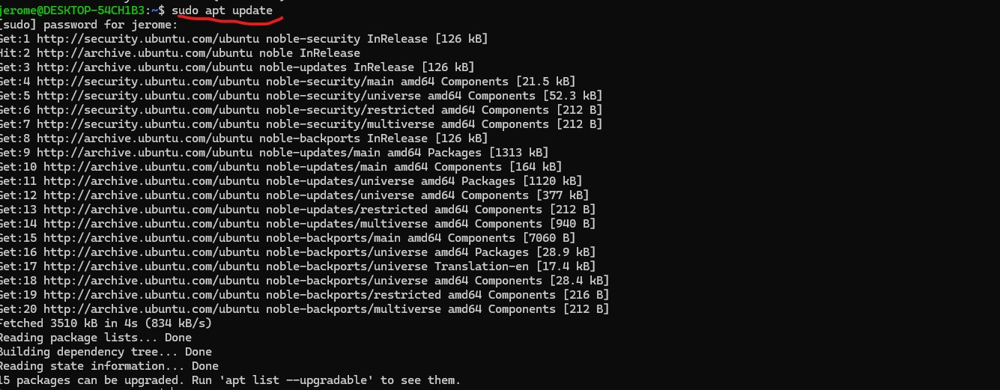
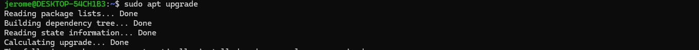

1. Make Directory

The screenshot above makes a directory, add a txt file and append date to it
2. Copy alpha to Temp folder

The screenshot above copied the directory from alpha folder to temp folder
3. Move Beta from CLIlab to Archive

The screenshot above move beta.txt from Clilab folder to Archive folder
4. Remove Epsilon

The screenshot above is to remove Epsilon from the Clilab folder
5. Copy File From ETC

The screenshot above created a txt file called services in cli_lab folder and copied files from ETC to services.txt
6. Count Lines

The screenshot above shows the number of lines in servies TXT file
7. Non Comment

The screenshot above print the Non-Comment Line
8. Grep SSH

The screenshot searches for the string SSH in Text File
9. Man Less

The screenshot shows the function of -R in the less command
10. Dos 2 Unix

The screenshot shows the script that converts dos command to Unix
11. Mkdir

The screenshot shows the the description for the parent directory
12. Update

The screenshot helps update existing packages
13. Upgrade

The screenshot helps upgrade existing packages
14. Install HTOP

The screenshot helps install HTOP
15. Htop Version

The screenshot shows Htop version
16. Remove Htop

The screenshot shows how to remove Htop
17. Reinstall Htop

The screenshot shows how to resinstall Htop
18. Htop Hold

The screenshot stops Htop from being updated when system packages are being updated
19. Show Hold

The screenshot shows the packages under hold
20. Display Package Information

The screenshot shows the packages under hold
21. Export Curl Dependencies

The screenshot shows the script to export curl depenencies
22. Difference between APT Remove and Purge

The screenshot shows the difference between remove and purge. Remove keeps the setting while purge deletes all related files and setting
23. Enable Universe Repository

The screenshot shows how to enable universe repository
24. Refresh Package

The screenshot shows how to refresh existing package
25.  Install FOrtune

The screenshot shows how to install fortune
26. Edit bash to Add fortune Command

The screenshot shows the command on how to add fortune command
27. Fortune Output

The screenshot shows the output for Fortune when WSL is restarted

